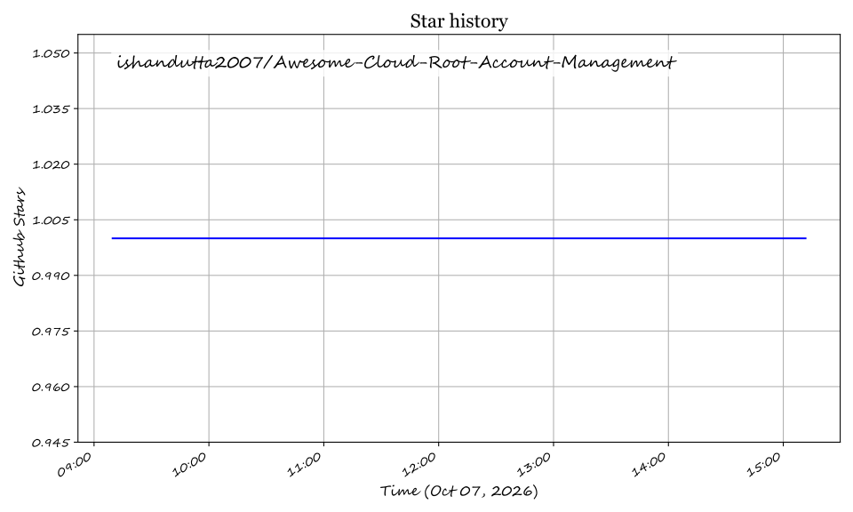

# Awesome-Cloud-Root-Account-Management 🔐 👑

  

  
  
  
  
  
  

---

## 🌟 Top Cloud Root Account Management & Privileged Access Control Ecosystem 🛡️

**Curated Directory of Commercial PAM Platforms, Hyperscaler Controls & Open-Source Security Solutions**  
*Focused on AWS Root Protection, Azure PIM, GCP Super Admin Governance, Privileged Session Management, Just-in-Time Access, Credential Vaulting & Self-Hosted PAM Infrastructure.*

**Last updated: October 2026** 📅

---

### 📌 Overview & SEO Summary 🔍

Welcome to the definitive, SEO-optimized directory of **cloud root account management platforms**, **open-source privileged access management (PAM) frameworks**, and **just-in-time (JIT) access tools**. Root accounts—such as AWS Organization Root, Azure Global Administrator, and Google Cloud Super Admin—represent the ultimate level of administrative privilege in cloud infrastructure, bypassing standard guardrails and standard IAM policies. 

Securing root credentials through **zero-standing privileges (ZSP)**, **hardware MFA enforcement**, **automated credential rotation**, **ephemeral access certificates**, and **session recording** is essential for compliance (SOC 2, ISO 27001, HIPAA, PCI-DSS) and preventing catastrophic cloud account takeovers.

Whether evaluating enterprise-grade commercial platforms (like *CyberArk*, *BeyondTrust*, *Delinea*, *Okta*, *StrongDM*) or self-hostable open-source solutions (like *Teleport*, *OpenBao*, *Keycloak*, *Authentik*, *Vaultwarden*), this resource provides detailed market sizing, exact pricing structures, free tier limits, company valuation data, and open-source star metrics.

---

## 📑 Table of Contents 📜

- [🏢 SaaS & Commercial Platforms](#-saas--commercial-platforms)
- [🔓 Open-Source GitHub Projects](#-open-source-github-projects)
- [🛠️ How to Contribute](#%EF%B8%8F-how-to-contribute)
- [📊 Star History](#-star-history)
- [🤝 Support & Sponsorship](#-support--sponsorship)
- [⚠️ Security Best Practices & Disclaimer](#%EF%B8%8F-security-best-practices--disclaimer)

---

## 🏢 SaaS & Commercial Platforms 💼

### 📈 Market Size & Sector Structure

The global **Privileged Access Management (PAM) and Cloud Root Governance market** is estimated at **$3.8 Billion in 2026** and is projected to reach **$7.5 Billion by 2030** (CAGR of ~18.5%). The sector is **moderately fragmented**: while legacy enterprise deployments are dominated by market leaders (*CyberArk*, *BeyondTrust*, *Delinea*), cloud-native adoption is split between hyperscaler native governance tools (*AWS*, *Microsoft Azure*, *Google Cloud*) and modern zero-trust infrastructure access tools (*StrongDM*, *Teleport*, *Okta Privileged Access*).

*Sorted by Valuation / Market Capitalization (Descending)* 📊

| SaaS / Commercial Platform | Company / Owner | Valuation / Market Cap | Standard Edition Starting Price | Free Tier / Free Trial Limits | Description & Security Features |
| :--- | :--- | :--- | :--- | :--- | :--- |
| **[Azure AD Privileged Identity Management (PIM)](https://azure.microsoft.com/en-us/products/microsoft-entra-id/)** 🔷 | Microsoft | **~$3.90 Trillion** | **$9.00/user/month** (Requires Entra ID P2 license) | **30-day free trial** of Microsoft Entra ID P2 | **Azure-native just-in-time access** — PIM for Entra roles, Azure resource roles, and access groups. Features time-bound activations, multi-factor authentication (MFA) enforcement, approval workflows, and audit reviews. |
| **[AWS Root Account Management](https://docs.aws.amazon.com/IAM/latest/UserGuide/root-user-best-practices.html)** ☁️ | Amazon | **~$2.00 Trillion** | **$0.00** (Included with AWS Cloud Account) | **Free forever** (Native AWS IAM controls included with account) | **AWS-native root account protection** — Provides AWS Control Tower, Organizations SCPs, and IAM Identity Center. Best practice enforces deleting root access keys, locking hardware MFA, and eliminating standing root usage. |
| **[Google Cloud Super Admin Console](https://cloud.google.com/identity/docs/concepts/overview)** 🌐 | Google (Alphabet) | **~$2.00 Trillion** | **$6.00/user/month** (Google Workspace / Cloud Identity Core) | **14-day free trial** for Cloud Identity Premium | **GCP-native super admin governance** — Enforces Google Cloud Organization Policies, Security Command Center privileged monitoring, and Context-Aware Access for GCP root admins. |
| **[HashiCorp Vault Enterprise](https://www.vaultproject.io/)** 🔐 | HashiCorp (IBM) | **~$5.00 Billion** (Acquired by IBM) | **$0.03/hour (~$25/month)** on HCP Vault Dedicated | **$500 free trial credits** (valid for 30 days on HCP) | **Identity-based secret & root credential management** — Offers dynamic secret generation, PKI certificate authority, automated rotation, and enterprise audit logging across multi-cloud environments. |
| **[Okta Privileged Access](https://www.okta.com/)** 🔑 | Okta | **~$15.00 Billion** | **$4.00/user/month** (Add-on to Okta Workforce Identity) | **30-day free trial** with Okta Workforce Developer | **Just-in-time cloud infrastructure access** — Delivers zero-standing privileges for cloud accounts, SSH, and RDP sessions with centralized policy management and session recording. |
| **[CyberArk Privileged Access Manager](https://www.cyberark.com/)** 🏛️ | CyberArk | **~$8.00 Billion** | **$15.00/user/month** (Standalone Privileged Cloud starter) | **30-day free trial** of CyberArk Identity & PAM | **Enterprise PAM platform** — Digital vaulting, isolated session recording, continuous threat analytics, and automated credential rotation for root accounts and domain admins. |
| **[BeyondTrust Password Safe](https://www.beyondtrust.com/)** 🔵 | BeyondTrust | **~$3.00 Billion** (Private Equity) | **$6.25/user/month** ($75/user/year base vault) | **14-day free trial** for cloud PAM sandbox | **Privileged password & session management** — Automated discovery and vaulting of root passwords, live session monitoring, session termination, and keystroke logging. |
| **[Delinea Secret Server](https://delinea.com/)** 🟠 | Delinea | **~$2.50 Billion** (Private Equity) | **$12.00/user/month** (Cloud Edition) | **30-day free trial** (up to 25 test users & 100 secrets) | **Enterprise credential vaulting** — Automated discovery and rotation of root passwords, secret dependency mapping, and out-of-the-box regulatory compliance reporting. |
| **[StrongDM](https://www.strongdm.com/)** 🛡️ | StrongDM | **~$1.00 Billion** (Private) | **$70.00/user/month** (Infrastructure Access Tier) | **14-day free trial** (unlimited users & gateways) | **Zero-trust infrastructure access platform** — Replaces VPNs and root credentials with protocol-aware proxy access for SSH, RDP, Kubernetes clusters, and cloud databases. |
| **[One Identity Safeguard](https://www.oneidentity.com/)** 🏢 | One Identity (Quest) | **~$800 Million** (Private Equity) | **$18.00/user/month** (Safeguard for Passwords cloud) | **30-day free trial** (Virtual appliance download) | **Privileged credential vault & session manager** — Secure password vaulting, session recording, and real-time privileged behavior analytics for cloud and on-premise infrastructure. |

---

## 🔓 Open-Source GitHub Projects 🚀

*Self-hosted open-source tools for privileged access control, secrets vaulting, identity federation, and root account session management.*

*Sorted by GitHub_Stars_Count (Descending)* 🌟

- **[Keycloak](https://github.com/keycloak/keycloak)**  🔐  
  **Open-source identity and access management**, Apache-2.0 licensed. **24.5K+ GitHub_Stars**. Provides Single Sign-On (SSO), OpenID Connect (OIDC), SAML 2.0, identity brokering, and fine-grained access control for enterprise IAM and privileged workflows.

- **[Vaultwarden](https://github.com/dani-garcia/vaultwarden)**  🏰  
  **Lightweight Bitwarden-compatible server in Rust**, GPL-3.0 licensed. **42.1K+ GitHub_Stars**. Self-hostable password and secret vault ideal for small teams needing secure, encrypted storage of cloud root credentials and recovery keys.

- **[Teleport](https://github.com/gravitational/teleport)**  🚀  
  **The leading open-source privileged access management platform**, AGPL-3.0 licensed. **17.2K+ GitHub_Stars**. Provides unified zero-trust access to SSH, Kubernetes, cloud databases, AWS consoles, and web applications using short-lived X.509/SSH certificates and session recording.

- **[Authentik](https://github.com/goauthentik/authentik)**  🎨  
  **Open-source identity provider for unified authentication**, MIT licensed. **14.8K+ GitHub_Stars**. Features flexible authentication pipelines, multi-factor authentication (MFA), user lifecycle management, and protocol support for OIDC, SAML, LDAP, and RADIUS.

- **[Authelia](https://github.com/authelia/authelia)**  🔑  
  **Lightweight authentication and authorization server**, Apache-2.0 licensed. **19.5K+ GitHub_Stars**. Adds two-factor authentication (2FA) and Single Sign-On (SSO) to web portals and cloud management dashboards via reverse proxies (Traefik, NGINX, Caddy).

- **[OpenBao](https://github.com/openbao/openbao)**  🏛️  
  **Open-source, community-governed secrets management engine**, MPL-2.0 licensed. **4.2K+ GitHub_Stars**. Managed under the Linux Foundation's OpenSSF as a community fork of Vault, providing dynamic secret generation, PKI certificate management, and data encryption.

- **[FreeIPA](https://github.com/freeipa/freeipa)**  🐧  
  **Integrated identity management for Linux/Unix environments**, GPL-3.0 licensed. **1.8K+ GitHub_Stars**. Combines 389 Directory Server (LDAP), MIT Kerberos, Dogtag Certificate System, NTP, and DNS for centralized identity, domain governance, and sudo access control.

- **[Kanidm](https://github.com/kanidm/kanidm)**  🦀  
  **Modern fast identity management platform written in Rust**, MPL-2.0 licensed. **2.9K+ GitHub_Stars**. Designed for high performance, memory safety, and modern auth standards including WebAuthn, Passkeys, OAuth2, OIDC, and LDAP identity resolution.

- **[OpenLDAP](https://github.com/openldap/openldap)**  📁  
  **Foundational open-source LDAP directory server**, OpenLDAP Public License. **850+ GitHub_Stars**. The battle-tested directory service underpinning traditional PAM integrations, user directories, and central authentication backends.

- **[Boundary](https://github.com/hashicorp/boundary)**  🌐  
  **Identity-based infrastructure access management**, MPL-2.0 licensed. **4.8K+ GitHub_Stars**. Enables fine-grained, dynamic access to private cloud hosts and services based on user identity without exposing internal networks.

- **[Infisical](https://github.com/Infisical/infisical)**  ⚡  
  **Open-source secret management platform**, MIT licensed. **15.4K+ GitHub_Stars**. Centralizes cloud keys, environment variables, API credentials, and root secrets with role-based access control and developer workflow integration.

- **[Bitwarden Server](https://github.com/bitwarden/server)**  🛡️  
  **Official core backend for Bitwarden**, AGPL-3.0 licensed. **15.1K+ GitHub_Stars**. Enterprise-grade open-source credential vaulting for managing cloud organization secrets, master credentials, and recovery keys.

---

## 🛠️ How to Contribute 🤝

Contributions are welcome! Follow these steps to submit new root account management platforms, commercial PAM products, or open-source security tools:

1. 🍴 **Fork** the repository.
2. 📝 **Add/edit** entries in `README.md` maintaining table/list structure and precise pricing/star formatting.
3. 🔗 Include project title, official website/GitHub link, exact star metrics, license, and concise description.
4. 🚀 Submit a **Pull Request** with a descriptive summary of your changes.

---

## 📊 Star History 📈

---

## 🤝 Support & Sponsorship ☕

If you find this cloud root account management directory useful, please consider supporting the project:

- ⭐ **Star** this repository to increase community visibility!
- 🔀 **Fork** and share with fellow cloud security engineers, DevOps leads, and platform teams.
- ☕ **Sponsor & Buy Me a Coffee**: Support ongoing open-source curation via the [GitHub Sponsor Dashboard](https://github.com/sponsors/ishandutta2007).

---

## ⚠️ Security Best Practices & Disclaimer 🔐

- This is a **community-curated directory** for educational and architectural reference — not an endorsement. ℹ️
- **Root Accounts represent ultimate risk**: AWS root, Azure Global Admin, and GCP Super Admin possess unrestricted control. **Best practice is zero-standing root access**: lock away root credentials in a physical vault, enforce FIDO2/WebAuthn hardware MFA, delete programmatic access keys, and operate daily administration via scoped IAM roles. 🛡️
- **Commercial PAM Costs**: Commercial platforms range from **$4.00–$70.00/user/month** up to **$50K+ annual enterprise contracts**. Verify current pricing and deployment models directly with vendors. 💰
- **Self-Hosting Open-Source PAM**: Tools like *Teleport*, *OpenBao*, and *Keycloak* require active maintenance, hardening, and HA infrastructure to guarantee zero downtime for critical access control systems. ⚡

---

  <b>Made with ❤️ for cloud security architects, PAM engineers, and open-source advocates.</b>

## ⭐ Star History

<a href="https://star-history.com/#ishandutta2007/Awesome-Cloud-Root-Account-Management&Timeline" align="center">
  <picture>
    <source media="(prefers-color-scheme: dark)" srcset="assets/ishandutta2007_Awesome-Cloud-Root-Account-Management_growth.svg">
    
  </picture>
</a>
